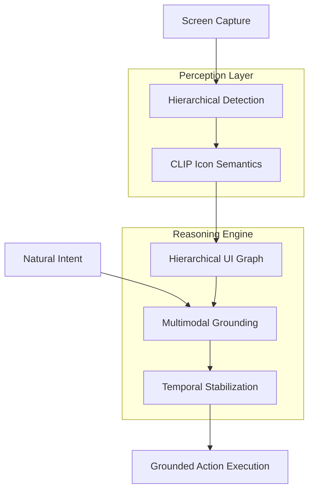

# VIGA: Vision-Grounded Interaction Agent 🚀

**VIGA** is a state-of-the-art, **locator-free UI automation system** that perceives and interacts with interfaces purely through visual and semantic understanding. By moving away from brittle CSS/XPath selectors, VIGA enables robust automation that survives UI redesigns and operates seamlessly across different platforms.

---

## 🌟 Key Features

| Feature | Description | Technology |
| :--- | :--- | :--- |
| **Locator-Free** | Operates entirely on visual input (pixels), not internal DOM selectors. | YOLOv8 / CLIP |
| **Hierarchical Perception** | Understands UI structure by detecting layout containers and atomic elements. | Multistage Detection |
| **Semantic Grounding** | Maps natural language intent (e.g., "click settings") to the best visual candidate. | CLIP / Sentence-Transformers |
| **Temporal Stability** | Maintains focus on elements across dynamic UI transitions and frame drops. | Temporal Management |
| **Graph Reasoning** | Models the UI as a relational graph (Spatial & Hierarchical). | NetworkX |

---

## 🏗️ Architecture

VIGA treats every UI as an interactive scene. The execution pipeline is divided into three major stages: **Perception**, **Reasoning**, and **Execution**.

### High-Level Workflow



### Technical Breakdown

1.  **Hierarchical Perception**:
    *   **Layout Detector**: Identifies macro-structures like sidebars, forms, and toolbars.
    *   **Atomic Detector**: Identifies micro-elements like buttons, checkboxes, and input fields.
    *   **CLIP Integration**: When an icon lacks a label (e.g., a gear icon), VIGA uses CLIP to perform zero-shot classification to understand its semantic purpose.

2.  **UI Graph Construction**:
    *   Constructs a Directed Graph where nodes are elements and edges represent **'parent_of'** (containment) or **'near'** (spatial proximity).
    *   This allows the agent to reason about context (e.g., "the 'Save' button *inside* the 'Settings' form").

3.  **Multimodal Grounding**:
    *   Converts user intents into semantic embeddings.
    *   Performs a similarity search against the UI Graph nodes, weighing text, object type, and hierarchical context simultaneously.

---

## 🛠️ Installation

1.  **Clone the Repository**:
    ```bash
    git clone https://github.com/GOURAV-PATRA/VIGA.git
    cd VIGA
    ```

2.  **Environment Setup**:
    ```bash
    python -m venv .venv
    .\.venv\Scripts\activate
    pip install -r requirements.txt
    ```

3.  **Model Downloads**:
    The agent will automatically download the necessary YOLOv8 and CLIP models on the first run.

---

## 🚀 Usage

Run the agent by providing a natural language command:

```bash
python main.py "click the search icon in the top toolbar"
```

### Command Options
- `--simulation`: (Default) Prints the coordinates and actions without clicking.
- `--active`: Executes real mouse movements and clicks (requires admin privileges).

---

## 🔍 Module Documentation

| Module | File Path | Responsibility |
| :--- | :--- | :--- |
| **Perception** | `src/perception/` | Detection, CLIP classifications, and OCR. |
| **Graph Builder** | `src/reasoning/graph_builder.py` | UI relationship mapping via DiGraph. |
| **Grounding** | `src/reasoning/grounding.py` | Intent-to-element semantic matching. |
| **Temporal** | `src/utils/temporal.py` | Cross-frame element tracking. |

---

## 🤝 Contributing

We welcome contributions to improve the perception models and grounding logic.
1. Fork the Project.
2. Create your Feature Branch (`git checkout -b feature/AmazingFeature`).
3. Commit your Changes (`git commit -m 'Add AmazingFeature'`).
4. Push to the Branch (`git push origin feature/AmazingFeature`).
5. Open a Pull Request.

---

## 📜 License
Distributed under the MIT License. See `LICENSE` for more information.

---
**Developed with ❤️ for Vision-Language Control.**
